<div align="center">

# NextCart - Flutter E-Commerce App

**A production-ready, full-featured e-commerce mobile application built with Flutter & Firebase**

*Open-source Flutter shopping app with cart, wishlist, checkout, order tracking, push notifications & more*

*Clean Architecture | Riverpod | Firestore | Material Design 3*

[](https://flutter.dev)
[](https://dart.dev)
[](https://firebase.google.com)
[](https://riverpod.dev)
[]()
[]()

[](assets/apk/nextcart-v1.0.0.apk)

</div>

---

## Overview

NextCart is an open-source e-commerce app for Android, iOS, and Web. It provides a complete online shopping experience including product browsing, search, shopping cart, wishlist, checkout with cash on delivery, real-time order tracking, and push notifications. Built with clean architecture and powered by Firebase for authentication, database, and storage.

---

## Screenshots

<div align="center">
<table>
  <tr>
    <td align="center">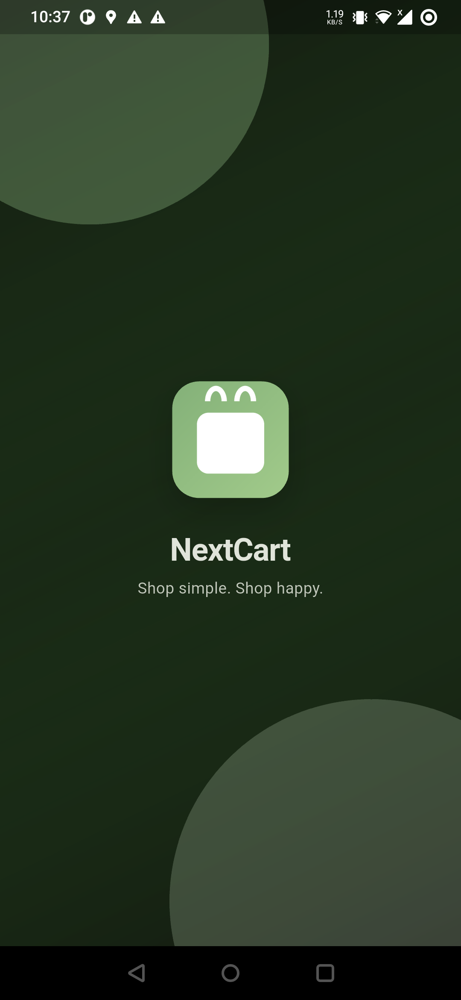<br/><b>Splash</b></td>
    <td align="center">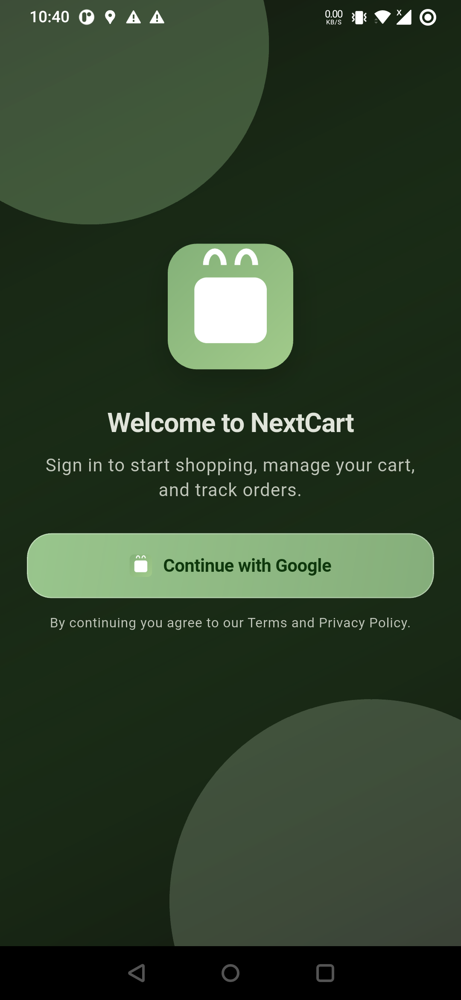<br/><b>Login</b></td>
    <td align="center">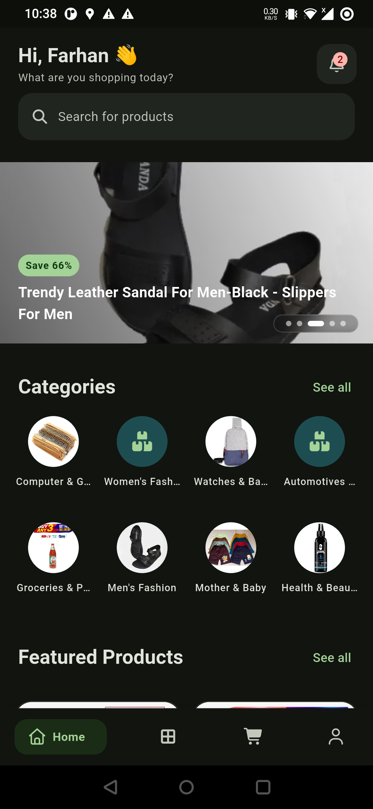<br/><b>Home</b></td>
    <td align="center">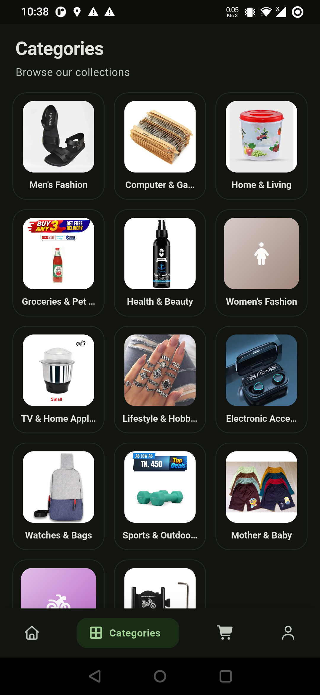<br/><b>Categories</b></td>
  </tr>
  <tr>
    <td align="center">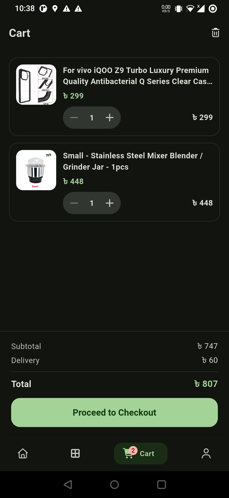<br/><b>Cart</b></td>
    <td align="center">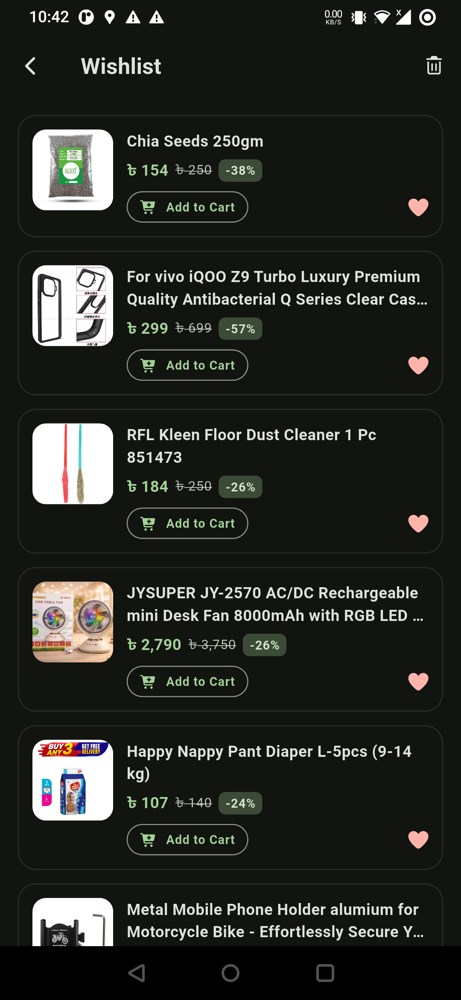<br/><b>Wishlist</b></td>
    <td align="center">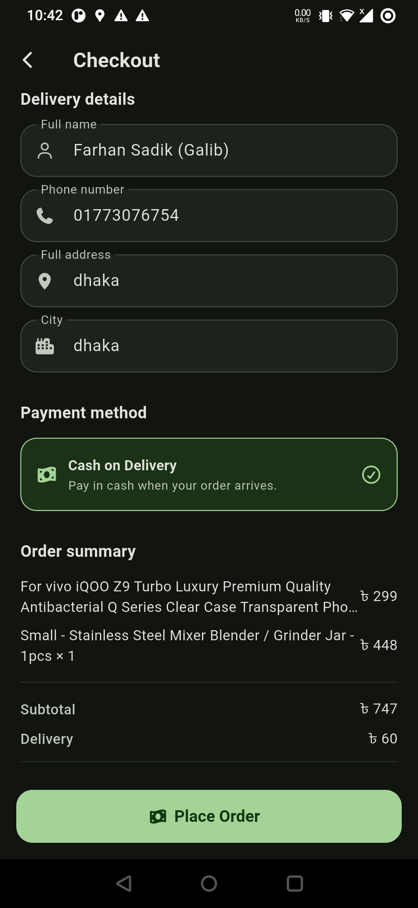<br/><b>Checkout</b></td>
    <td align="center">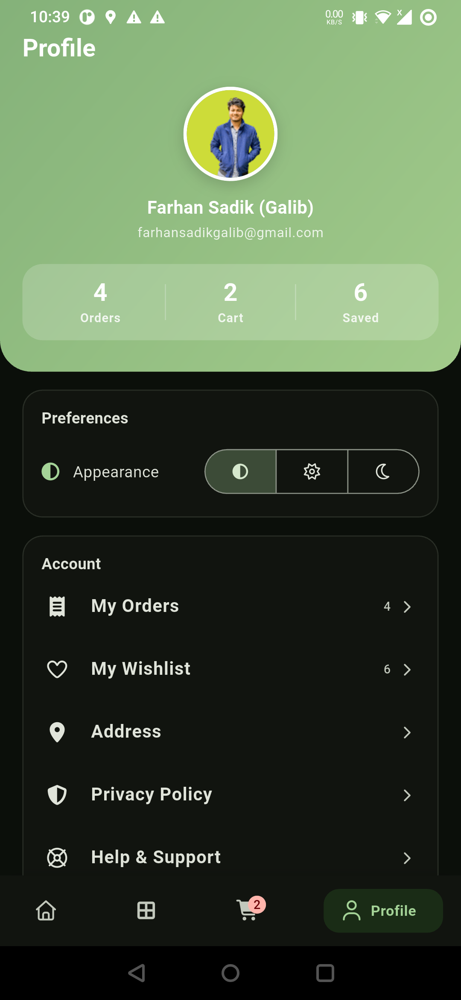<br/><b>Profile</b></td>
  </tr>
  <tr>
    <td align="center">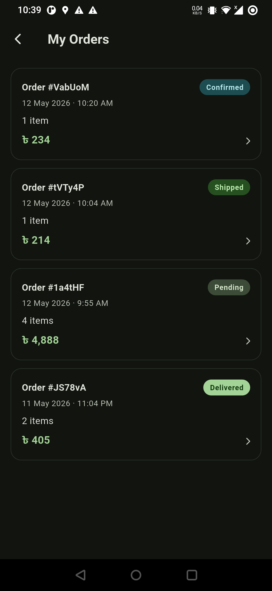<br/><b>Orders</b></td>
    <td align="center">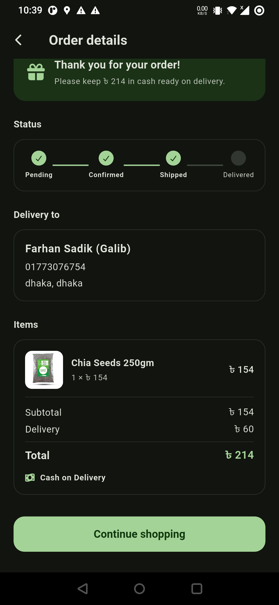<br/><b>Order Details</b></td>
    <td align="center">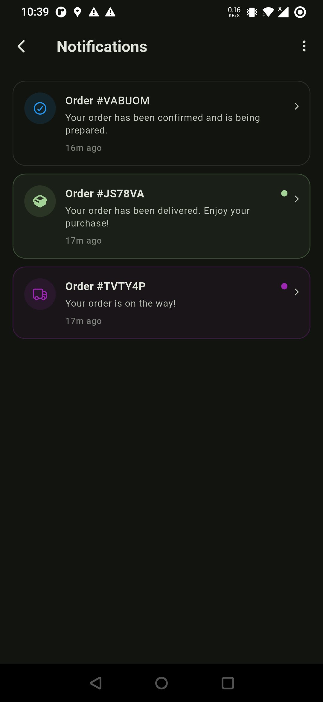<br/><b>Notifications</b></td>
    <td></td>
  </tr>
</table>
</div>

---

## Tech Stack

- **Flutter** (Dart 3.8+) -- cross-platform (Android, iOS, Web)
- **Firebase** -- Auth, Firestore, Cloud Storage, Cloud Messaging
- **Riverpod** -- state management (with code generation)
- **GoRouter** -- declarative routing with auth guards (StatefulShellRoute)
- **Freezed** -- immutable data models
- **Dio** -- HTTP networking
- **GNav** -- modern bottom navigation bar
- **Local Notifications** -- push notifications for order status updates
- **Material Design 3** -- green-themed UI with responsive layout (ScreenUtil)

## Features

- Google Sign-In & Firebase Authentication
- Product catalog with category filtering
- Full-text product search
- Shopping cart (add, remove, update quantity)
- Wishlist (save favorite products)
- Checkout with delivery details & cash on delivery
- Order history with real-time status tracking (pending, confirmed, shipped, delivered)
- Push notifications on order status changes
- In-app notification center with unread badge
- User profile & delivery address management
- Dark mode / light mode / system theme
- Onboarding flow for new users
- Responsive UI for Android, iOS & Web

## Project Structure

```
lib/
├── app/                # Router, routes, navigation shell
├── core/               # DI providers, theme, storage, utils, shared widgets
├── features/           # Feature modules (Clean Architecture)
│   ├── auth/           #   Authentication
│   ├── home/           #   Home screen
│   ├── categories/     #   Product categories
│   ├── products/       #   Product listings
│   ├── product_detail/ #   Product detail view
│   ├── cart/           #   Shopping cart
│   ├── checkout/       #   Checkout process
│   ├── orders/         #   Order management
│   ├── notifications/  #   Push & in-app notifications
│   ├── wishlist/       #   Wishlist
│   ├── profile/        #   User profile
│   └── search/         #   Product search
└── shared/             # App-wide shared widgets
```

Each feature follows the **data / domain / presentation** layer split.

## Getting Started

### Prerequisites

- Flutter SDK (stable channel)
- Dart 3.8+
- Android Studio / Xcode (for emulators)
- A Firebase project (see [Firebase setup docs](https://firebase.google.com/docs/flutter/setup))

### Setup

```bash
# Clone the repo
git clone <repo-url>
cd nextcart

# Install dependencies
flutter pub get

# Run code generation (Freezed, Riverpod, JSON serialization)
dart run build_runner build --delete-conflicting-outputs

# Run the app
flutter run
```

### Useful Commands

```bash
# Watch mode for code generation (re-runs on file changes)
dart run build_runner watch --delete-conflicting-outputs

# Run linter
flutter analyze

# Run tests
flutter test

# Build release APK
flutter build apk

# Build for iOS
flutter build ios

# Build for web
flutter build web
```

## Firebase Setup

The app uses the following Firebase services:

| Service | Purpose |
|---------|---------|
| Firebase Auth | User authentication (email, Google Sign-In) |
| Cloud Firestore | Product catalog, orders, cart, notifications, user data |
| Cloud Storage | Product images and assets |
| Cloud Messaging | Push notification permissions and token management |

Firestore security rules allow public reads for products/categories and user-scoped writes for carts, orders, and notifications. See [firestore.rules](firestore.rules) and [storage.rules](storage.rules).

### Notifications

When an order status changes in Firestore, the app:
1. Detects the change via a real-time orders stream listener
2. Writes a notification document to `users/{uid}/notifications/`
3. Shows a local push notification on the device
4. Tapping the notification navigates to the order detail screen

## Architecture

The app follows **Clean Architecture** with three layers per feature:

1. **Data** -- repository implementations (Firebase, API calls)
2. **Domain** -- models (Freezed classes), repository interfaces
3. **Presentation** -- UI widgets, ViewModels (Riverpod providers)

Dependency injection is handled via Riverpod providers in `core/di/`.

## License

This project is private and not licensed for redistribution.

---

<div align="center">

**Built with Flutter & Firebase**

`ecommerce` `flutter-ecommerce` `flutter-shopping-app` `shopping-cart` `online-store` `flutter-app` `flutter` `dart` `firebase` `firestore` `riverpod` `clean-architecture` `material-design-3` `go-router` `freezed` `push-notifications` `wishlist` `order-tracking` `google-sign-in` `cross-platform`

</div>
